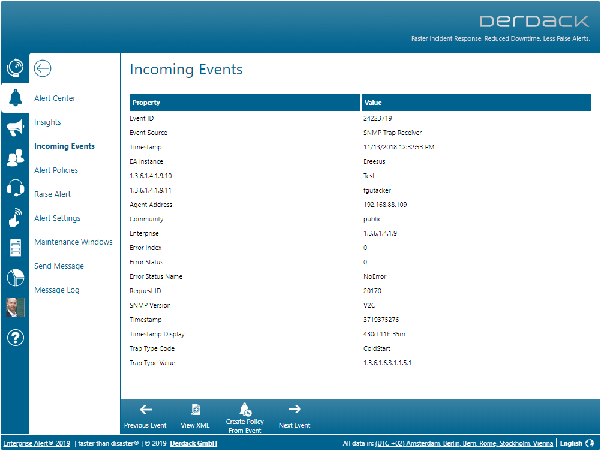

# Aussagekräftige Parameter-Namen in SNMP Events

Enterprise Alert bietet die Möglichkeit direkt SNMP-Traps zu empfangen und daraus Alarme zu generieren.

Die SNMP-Trap enthalten eine Reihe von Parametern, die durch OIDs identifiziert werden. Diese OIDs sind recht kryptisch und wenig aussagekräftig.

Sogenannte MIB-Dateien dienen dazu den OIDs aussagekräftige Namen zuzuordnen.

Beispiel:

OID: 1.3.6.1.4.1.39165.1.5 -> Label: DeviceID

Im folgenden Beschreiben wir, wie Sie mittels eines Scripts solche MIB-Dateien importieren können, um in SNMP-Events aussagekräftige Namen anstatt der OIDs anzuzeigen. Diese Namen können Sie dann auch in Alarmierungsrichtlinien nutzen.

Die Vorgehensweise ist die folgende:

**Umwandeln der MIB-Dateien in XML**  
Hierzu nutzen wir den MIB Importer der Firma Paessler: https://www.de.paessler.com/tools/mibimporter

Dieses Tool parst ein oder mehrere MIB-Dateien (File -> Import MIB file). Wenn diese erfolgreich erkannt wurden, könne Sie eine sogenannte OIDLIB erzeugen (File -> Save OIDlib as ...). Dabei handelt es sich um eine XML-Datei, der Sie anschließend noch die Endung .xml geben sollten. Diese Tool fügt gleich automatisch Standard-OIDs und deren Namen hinzu.

Wenn Sie nun diese XML-Datei erzeugt haben, kopieren Sie diese auf Ihren Enterprise Alert Server in das Verzeichnis C:\Program Files\Enterprise Alert\SNMPConnector\MIB\XML\. Diesen Pfad können Sie in dem JavaScript SNMP-MIB-Importer3.js auch anpassen.

**Import in Enterprise Alert**  
In GitHub unter https://github.com/derdack/derdack-events-snmp haben wir das JavaScript SNMP-MIB-Importer.js bereit gestellt. Bitte kopieren Sie dieses Skript ebenfalls auf Ihren Enterprise Alert Server in das oben genannte Verzeichnis. Passen Sie in dem Skript bitte noch die Variable STRING_DB_CONNECTION so an, dass sie den Connection String zu Ihrer Enterprise Alert Datenbank enthält. Nun können Sie das Skript ausführen.

Fertig. Nun sollten die Parameter-Namen im SNMP-Event aussagekräftige Namen enthalten.
